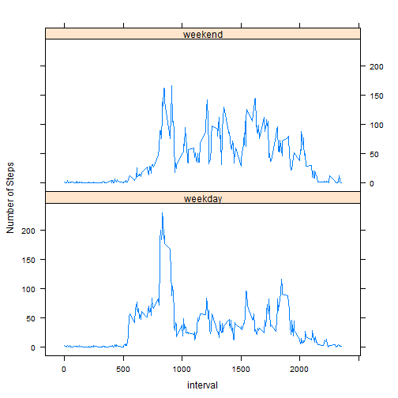

# Reproducible Research: Peer Assessment 1


## Loading and preprocessing the data

```r
unzip("activity.zip", overwrite = FALSE)
activity = read.csv("activity.csv", header = TRUE)
activity$date = as.Date(activity$date, "%Y-%m-%d")
```


## What is mean total number of steps taken per day?

```r
steps = activity[!is.na(activity$steps), ]
total = tapply(steps$steps, steps$date, sum)
hist(total, breaks = 25, col = "red", xlab = " Total number of steps each day", 
    main = "")
```

 

The mean total number of steps taken per day is

```r
mean(total)
```

```
## [1] 10766
```

The median total number of steps taken per day is

```r
median(total)
```

```
## [1] 10765
```


## What is the average daily activity pattern?

```r
m = aggregate(steps$steps, by = list(steps$interval), FUN = mean)
plot(m$Group.1, m$x, type = "l", ylab = "Average number of steps ", xlab = "Interval")
```

 

The 5-minute interval contains the maximum number of steps is 

```r
m[, 1][which(m[, 2] == max(m[, 2]))]
```

```
## [1] 835
```


## Imputing missing values
The total number of missing values in the dataset is

```r
sum(is.na(activity$steps))
```

```
## [1] 2304
```

Create a new dataset by replacing the `NA`s using the mean of 5-minute interval.

```r
t = merge(activity, m, by.x = "interval", by.y = "Group.1", all = TRUE)
t$steps = ifelse(is.na(t$steps), t$x, t$steps)
new = t[, 1:3]
```

Now repeat the Part 1 to see the difference

```r
total = tapply(new$steps, new$date, sum)
hist(total, breaks = 25, col = "red", xlab = " Total number of steps each day", 
    main = "")
```

 

The mean total number of steps taken per day is

```r
mean(total)
```

```
## [1] 10766
```

The median total number of steps taken per day is

```r
median(total)
```

```
## [1] 10766
```


## Are there differences in activity patterns between weekdays and weekends?
Create a new factor variable in the dataset with two levels -- "weekday" and "weekend" indicating whether a given date is a weekday or weekend day.

```r
new$weekend = ifelse(as.POSIXlt(new$date)$wday == 6 | as.POSIXlt(new$date)$wday == 
    0, 1, 0)
new$weekend = factor(new$weekend, label = c("weekday", "weekend"))
m = aggregate(new$steps, by = list(new$interval, new$weekend), FUN = mean)
```

Make a panel plot containing both weekend and weekday activity patterns

```r
require("lattice")
xyplot(x ~ Group.1 | Group.2, data = m, type = "l", layout = c(1, 2), ylab = "Number of Steps", 
    xlab = "interval")
```

 


